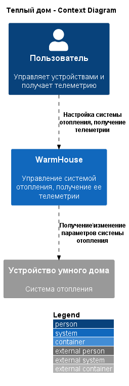
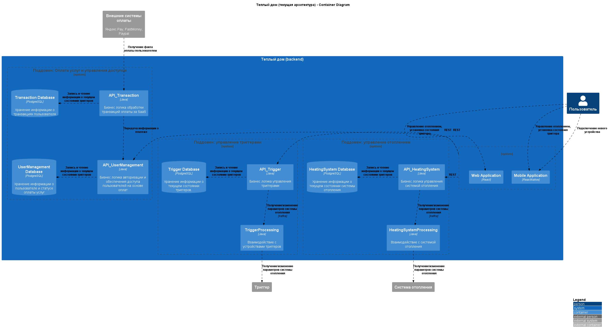
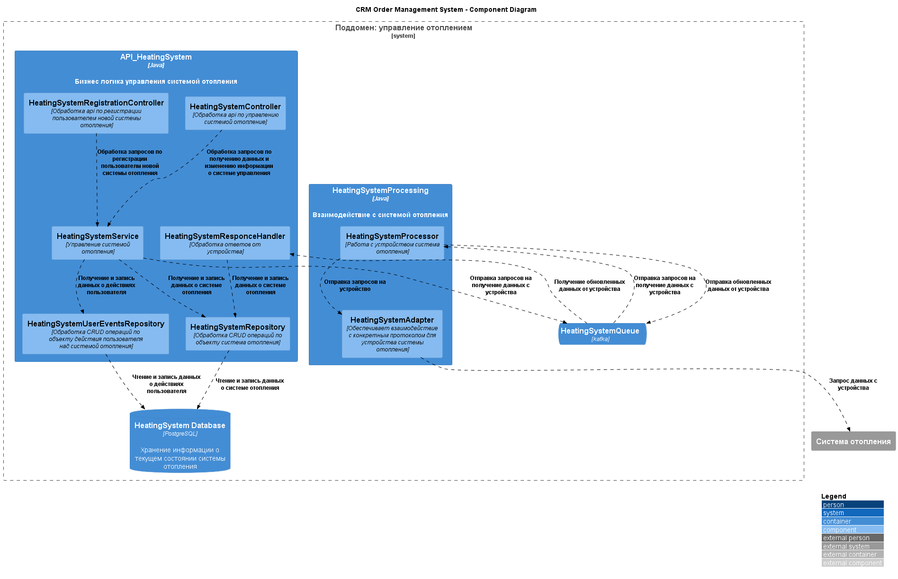
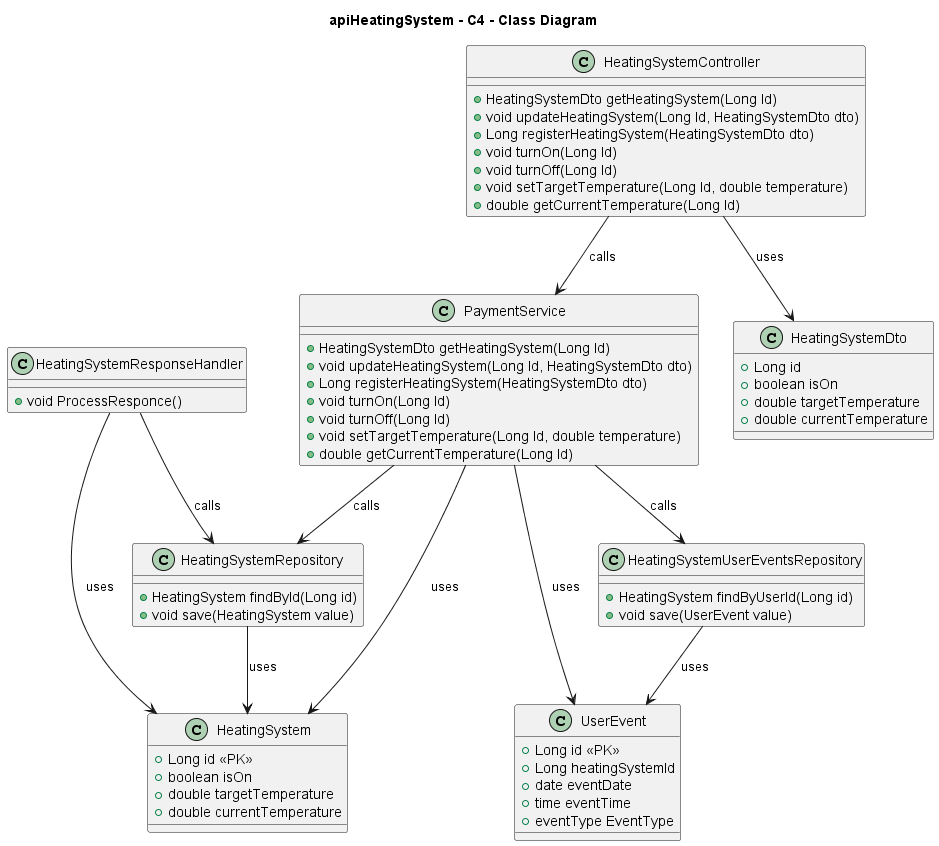
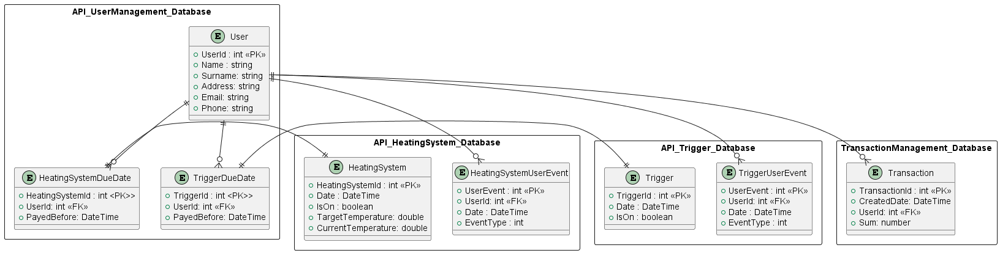

# Project_template

Тип: Материал
Родитель: Описание проекта для 11 когорты (https://www.notion.so/11-03abbbbc8bcb49ed9b85c9b6d1174056?pvs=21)

Это шаблон для решения проектной работы. Структура этого файла повторяет структуру заданий. Заполняйте его по мере работы над решением.

# Задание 1. Анализ и планирование

<aside>
💡 Чтобы составить документ с описанием текущей архитектуры приложения, можно часть информации взять из описания компани и условия задания. Это нормально.
</aside>

### 1. Описание функциональности монолитного приложения

**Управление отоплением:**

- Пользователи могут через веб-интерфейс включать и выключать отопление, устанавливать желаемую температуру.
- Система поддерживает REST интерфейс, через который и происходить вся работа бэкенд частью приложения

**Мониторинг температуры:**

- Пользователи могут просматривать текущую температуру в помещении через веб-интерфейс.
- Системой поддерживается только 1 датчик температуры для одного помещения.
- Система передает текущее значение температуры через REST интерфейс.

### 2. Анализ архитектуры монолитного приложения
Перечислите здесь основные особенности текущего приложения: какой язык программирования используется, какая база данных, как организовано взаимодействие между компонентами и так далее.
- Бэкенд приложения написан на Java. (Java 17)
- База данных Postgree SQL
- Приложение представляет собой классическое MVC c REST интерфейсом на базе spring-boot
- Пакеты:
    - `controller` - контроллеры для обработки HTTP-запросов.
    - `service` - сервисы для бизнес-логики.
    - `repository` - репозитории для доступа к базе данных.
    - `entity` - сущности JPA.
    - `dto` - объекты передачи данных (DTO).
- Выделен только 1 контроллер, который занимается и управлением отоплением и мониторингом температуры.
- Допустимо только использование одного датчика для системы отопления

### 3. Определение доменов и границы контекстов

Определение доменов и контекстов сделано не для текущей, а для целевой экосистемы умного дома.

- Поддомен: управление отоплением
    - Контекст: подключение устройства отопления
    - Контекст: управление отоплением
    - Контекст: взаимодействие с устройством, получение статуса и температуры
	
- Поддомен: управление триггерами (свет, ворота, ...)
    - Контекст: подключение устройства отопления
    - Контекст: управление отоплением
    - Контекст: взаимодействие с устройством
	
- Поддомен: Оплата услуг и управления доступом
	- Контекст: управление транзакциями
	- Контекст: статус оплаты и доступ

### **4. Проблемы монолитного решения**

В целом решение сделано граммотно для небольшой компании. 
Сервер у нас не содержит состояния и может быть легко промасштабирован горизонтально. 
Ресурсы по масштабированию PostgreSQL также еще не исчерпаны (через настройки репликации и шардирования).
С небольшими доработками можно легко настроить геошардинг.

Но согласно требованиям у нас существенно должна расшириться функциональность и вырасти количество пользователей системы. 
Разумно в этом случае также и пересмотреть текущую архитетуру и заложить больший потенциал для масштабирования в будущем. 

### 5. Визуализация контекста системы — диаграмма С4



```
@startuml
!include https://raw.githubusercontent.com/kirchsth/C4-PlantUML/extended/C4_Container.puml

AddRelTag("sync", $textColor="black", $lineColor="black", $lineStyle = DashedLine())

LAYOUT_WITH_LEGEND()

title Теплый дом - Context Diagram

Person(customer, "Пользователь", "Управляет устройствами и получает телеметрию")
System_Ext(ExtDevices, "Устройство умного дома", "Система отопления")
System(WarmHouse, "WarmHouse", "Управление системой отопления, получение ее телеметрии")

Rel_D(customer, WarmHouse, "Настройка системы отопления, получение телеметрии", $tags="sync")
Rel_D(WarmHouse, ExtDevices, "Получение\изменение параметров системы отопления", $tags="sync")

@enduml
```

# Задание 2. Проектирование микросервисной архитектуры

**Диаграмма контейнеров (Containers)**


```
@startuml
!include https://raw.githubusercontent.com/kirchsth/C4-PlantUML/extended/C4_Container.puml

AddRelTag("sync", $textColor="black", $lineColor="black", $lineStyle = DashedLine())

LAYOUT_WITH_LEGEND()

title Теплый дом (текущая архитектура) - Container Diagram

Person(customer, "Пользователь", "")

System(WarmHouse, "Теплый дом (backend)", "") {
    System_Boundary(frontend_boungary, "") {
      Container(webApp, "Web Application", "React", "")
      Container(mobileApp, "Mobile Application", "ReactNative", "")
    }
    System_Boundary(Trigger_boungary, "Поддомен: управление триггерами") {
      Container(apiTrigger, "API_Trigger", "Java", "Бизнес логика управления триггерами")
      Container(TriggerProcessing, "TriggerProcessing", "Java", "Взаимодействие с устройствами триггеров")
      ContainerDb(databaseTrigger, "Trigger Database", "PostgreSQL", "Хранение информации о текущем состоянии триггеров.")
    }
    System_Boundary(HeatingSystem_boungary, "Поддомен: управление отоплением") {
      Container(apiHeatingSystem, "API_HeatingSystem", "Java", "Бизнес логика управления системой отопления")
      Container(HeatingSystemProcessing, "HeatingSystemProcessing", "Java", "Взаимодействие с системой отопления")
      ContainerDb(databaseHeatingSystem, "HeatingSystem Database", "PostgreSQL", "Хранение информации о текущем состоянии системы отопления")
    }
    System_Boundary(Payment_boungary, "Поддомен: Оплата услуг и управления доступом") {
      Container(apiUserManagment, "API_UserManagement", "Java", "Бизнес логика авторизации и обеспечения доступа пользователей на основе оплат")
      Container(apiTransactionManagement, "API_Transaction", "Java", "Бизнес логика обработки транзакций оплаты за SaaS")
      ContainerDb(databaseUserManagment, "UserManagement Database", "PostgreSQL", "Хранение информации о пользователе и статусе оплаты услуг")
      ContainerDb(databaseTransactionManagement, "Transaction Database", "PostgreSQL", "Хранение информации о транзакциях пользователя")
    }
}

System_Ext(HeatingSystem, "Система отопления", "")
System_Ext(Trigger, "Триггер", "")
System_Ext(paymentSystem, "Внешние системы оплаты", "Яндекс.Pay, FastMoney, Paypal")

Rel_D(customer, mobileApp, "Управление отоплением, установка состояния триггера", $tags="sync")
Rel_D(customer, mobileApp, "Подключение нового устройства", $tags="sync")
Rel_D(customer, webApp, "Управление отоплением, установка состояния триггера", $tags="sync")
Rel_L(frontend_boungary, apiTrigger, "REST", $tags="sync")
Rel_L(frontend_boungary, apiUserManagment, "REST", $tags="sync")
Rel_L(frontend_boungary, apiHeatingSystem, "REST", $tags="sync")
Rel_L(apiTrigger, databaseTrigger, "Запись и чтение информации о текущем состоянии триггеров", $tags="sync")
Rel_L(apiHeatingSystem, databaseHeatingSystem, "Запись и чтение информации о текущем состоянии триггеров", $tags="sync")
Rel_D(HeatingSystemProcessing, HeatingSystem, "Получение\изменение параметров системы отопления", $tags="sync")
Rel_D(apiHeatingSystem, HeatingSystemProcessing, "Получение\изменение параметров системы отопления","kafka", $tags="sync")
Rel_L(apiUserManagment, databaseUserManagment, "Запись и чтение информации о текущем состоянии триггеров", $tags="sync")
Rel_L(apiTransactionManagement, databaseTransactionManagement, "Запись и чтение информации о текущем состоянии триггеров", $tags="sync")
Rel_D(TriggerProcessing, Trigger, "Получение\изменение параметров системы отопления", $tags="sync")
Rel_D(apiTrigger, TriggerProcessing, "Получение\изменение параметров системы отопления", "kafka", $tags="sync")
Rel_D(apiTransactionManagement, apiUserManagment, "Передача информации о платеже", $tags="sync")
Rel_D(paymentSystem, apiTransactionManagement, "Получение факта оплаты пользователем", $tags="sync")
@enduml
```

**Диаграмма компонентов (Components)**

Схемы для системы отопления и триггеров одинаковые. Поэтому привожу только одну из них.

```
@startuml
!include https://raw.githubusercontent.com/plantuml-stdlib/C4-PlantUML/master/C4_Component.puml
AddRelTag("sync", $textColor="black", $lineColor="black", $lineStyle = DashedLine())

LAYOUT_WITH_LEGEND()

title CRM Order Management System - Component Diagram

System_Boundary(HeatingSystem_boungary, "Поддомен: управление отоплением") {
    Container(apiHeatingSystem, "API_HeatingSystem", "Java", "Бизнес логика управления системой отопления") {
        Component(HeatingSystemController, "HeatingSystemController", "Обработка api по управлению системой отопление")
        Component(HeatingSystemRegistrationController, "HeatingSystemRegistrationController", "Обработка api по регистрации пользователем новой системы отопления")
        Component(HeatingSystemService, "HeatingSystemService", "Управление системой отопления")
        Component(HeatingSystemRepository, "HeatingSystemRepository", "Обработка CRUD операций по объекту система отопления")
        Component(HeatingSystemUserEventsRepository, "HeatingSystemUserEventsRepository", "Обработка CRUD операций по объекту действия пользователя над системой отопления")
        Component(HeatingSystemResponseHandler, "HeatingSystemResponceHandler", "Обработка ответов от устройства")
    }
    Container(HeatingSystemProcessing, "HeatingSystemProcessing", "Java", "Взаимодействие с системой отопления"){
        Component(HeatingSystemProcessor, "HeatingSystemProcessor", "Работа с устройством система отопления")
        Component(HeatingSystemAdapter, "HeatingSystemAdapter", "Обеспечивает взаимодействие с конкретным протоколом для устройства системы отопления")
    }
    ContainerQueue(HeatingSystemQueue, "HeatingSystemQueue", "kafka", "")
    ContainerDb(databaseHeatingSystem, "HeatingSystem Database", "PostgreSQL", "Хранение информации о текущем состоянии системы отопления")
}

System_Ext(HeatingSystem, "Система отопления", "")

Rel(HeatingSystemController, HeatingSystemService, "Обработка запросов по получению данных и изменению информации о системе управления", $tags="sync")
Rel(HeatingSystemRegistrationController, HeatingSystemService, "Обработка запросов по регистрации пользователм новой системы отопления", $tags="sync")
Rel(HeatingSystemService, HeatingSystemRepository, "Получение и запись данных о системе отопления", $tags="sync")
Rel(HeatingSystemResponseHandler, HeatingSystemRepository, "Получение и запись данных о системе отопления", $tags="sync")
Rel(HeatingSystemService, HeatingSystemUserEventsRepository, "Получение и запись данных о действиях пользователя", $tags="sync")
Rel(HeatingSystemRepository, databaseHeatingSystem, "Чтение и запись данных о системе отопления", $tags="sync")
Rel(HeatingSystemUserEventsRepository, databaseHeatingSystem, "Чтение и запись данных о действиях пользователя", $tags="sync")
Rel(HeatingSystemService, HeatingSystemQueue, "Отправка запросов на получение данных с устройства", $tags="sync")
Rel(HeatingSystemQueue, HeatingSystemResponseHandler, "Получение обновленных данных от устройства", $tags="sync")
Rel(HeatingSystemQueue, HeatingSystemProcessor, "Отправка запросов на получение данных с устройства", $tags="sync")
Rel(HeatingSystemProcessor, HeatingSystemAdapter, "Отправка запросов на устройство", $tags="sync")
Rel(HeatingSystemProcessor, HeatingSystemQueue, "Отправка обновленных данных от устройства", $tags="sync")
Rel(HeatingSystemAdapter, HeatingSystem, "Запрос данных с устройства", $tags="sync")
@enduml
```


**Диаграмма кода (Code)**


```
@startuml

title apiHeatingSystem - C4 - Class Diagram

class HeatingSystemController {
  + HeatingSystemDto getHeatingSystem(Long Id)
  + void updateHeatingSystem(Long Id, HeatingSystemDto dto)
  + Long registerHeatingSystem(HeatingSystemDto dto)
  + void turnOn(Long Id)
  + void turnOff(Long Id)
  + void setTargetTemperature(Long Id, double temperature)
  + double getCurrentTemperature(Long Id)
}

class PaymentService {
  + HeatingSystemDto getHeatingSystem(Long Id)
  + void updateHeatingSystem(Long Id, HeatingSystemDto dto)
  + Long registerHeatingSystem(HeatingSystemDto dto)
  + void turnOn(Long Id)
  + void turnOff(Long Id)
  + void setTargetTemperature(Long Id, double temperature)
  + double getCurrentTemperature(Long Id)
}

HeatingSystemController --> PaymentService : calls

class HeatingSystemRepository {
    + HeatingSystem findById(Long id)
    + void save(HeatingSystem value)
}

class HeatingSystemUserEventsRepository {
    + HeatingSystem findByUserId(Long id)
    + void save(UserEvent value)
}

class HeatingSystemResponseHandler {
    + void ProcessResponce()
}

PaymentService --> HeatingSystemRepository : calls
HeatingSystemResponseHandler --> HeatingSystemRepository : calls
PaymentService --> HeatingSystemUserEventsRepository : calls

class HeatingSystem {
    + Long id <<PK>>
    + boolean isOn
    + double targetTemperature
    + double currentTemperature
}

class HeatingSystemDto {
    + Long id
    + boolean isOn
    + double targetTemperature
    + double currentTemperature
}

HeatingSystemController --> HeatingSystemDto : uses
PaymentService --> HeatingSystem : uses
HeatingSystemResponseHandler --> HeatingSystem : uses
HeatingSystemRepository --> HeatingSystem: uses

class UserEvent {
    + Long id <<PK>>
    + Long heatingSystemId
    + date eventDate
    + time eventTime
    + eventType EventType
}

PaymentService --> UserEvent : uses 
HeatingSystemUserEventsRepository --> UserEvent : uses 

@enduml
```

# Задание 3. Разработка ER-диаграммы


```
@startuml

rectangle API_UserManagement_Database {
    entity "User" {
    + UserId : int <<PK>>
    + Name : string
    + Surname: string
    + Address: string
    + Email: string
    + Phone: string
    }

    entity "HeatingSystemDueDate" {
        + HeatingSystemId : int <PK>>
        + UserId: int <<FK>>
        + PayedBefore: DateTime
    }

        entity "TriggerDueDate" {
        + TriggerId : int <PK>>
        + UserId: int <<FK>>
        + PayedBefore: DateTime
    }
} 

rectangle API_HeatingSystem_Database {
    entity "HeatingSystemUserEvent" {
    + UserEvent : int <<PK>>
    + UserId: int <<FK>>
    + Date : DateTime
    + EventType : int
    }

    entity "HeatingSystem" {
    + HeatingSystemId : int <<PK>>
    + Date : DateTime  
    + IsOn : boolean
    + TargetTemperature: double
    + CurrentTemperature: double
    }
} 

rectangle API_Trigger_Database {
    entity "TriggerUserEvent" {
    + UserEvent : int <<PK>>
    + UserId: int <<FK>>
    + Date : DateTime
    + EventType : int
    }

    entity "Trigger" {
    + TriggerId : int <<PK>>
    + Date : DateTime  
    + IsOn : boolean
    }
} 

rectangle TransactionManagement_Database {
    entity "Transaction" {
    + TransactionId : int <<PK>>
    + CreatedDate: DateTime
    + UserId: int <<FK>>
    + Sum: number
    }
}

User ||--o{ HeatingSystemUserEvent
User ||--o{ TriggerUserEvent
User ||--o{ HeatingSystemDueDate
User ||--o{ TriggerDueDate
User ||--o{ Transaction
HeatingSystem ||--|| HeatingSystemDueDate
Trigger ||--|| TriggerDueDate

@enduml
```

# ❌ Задание 4. Создание и документирование API

### 1. Тип API

Укажите, какой тип API вы будете использовать для взаимодействия микросервисов. Объясните своё решение.

### 2. Документация API

Здесь приложите ссылки на документацию API для микросервисов, которые вы спроектировали в первой части проектной работы. Для документирования используйте Swagger/OpenAPI или AsyncAPI.